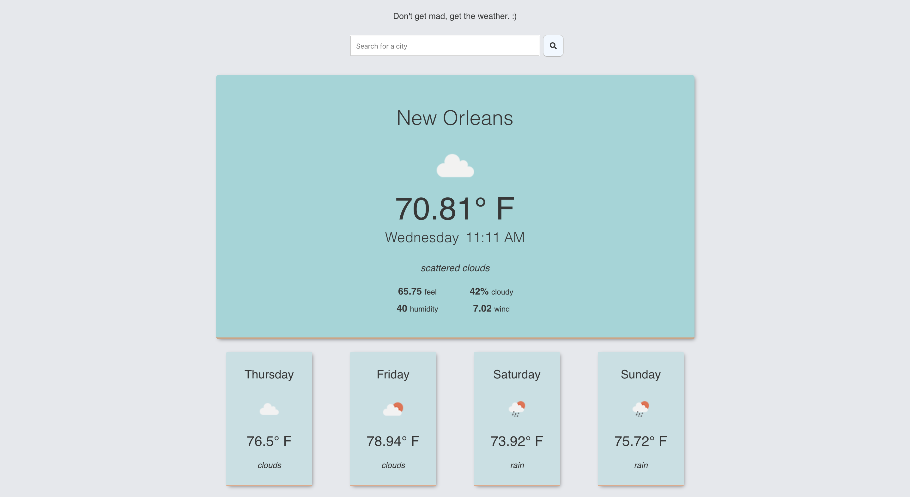

# DGMGP Coding Challenge
This is a small weather app built as a coding challenge for an interview for Don't Get Mad Get Paid.

Built on [React](https://reactjs.org/) and [Node.js/Express](https://expressjs.com/), including the following third-party APIs and libraries:
- [Open Weather Map API](https://openweathermap.org/api)
- [Google (Reverse) Geocoding API](https://developers.google.com/maps/documentation/geocoding/start#reverse)
- [Axios](https://github.com/axios/axios)
- [Moment](https://momentjs.com/)
- [Jest](https://jestjs.io/)
- [Enzyme](https://enzymejs.github.io/enzyme/)

&nbsp;   

## Running the app on your local machine
### Starting with yarn
From the `api` directory, run `yarn`, then `yarn dev` to start the server with nodemon.
In a separate terminal window, from the `client` directory, run `yarn`, then `yarn start`.

### Starting with npm
From the `api` directory, run `npm install`, then `npm run dev` to start the server with nodemon.
In a separate terminal window, from the `client` directory, run `npm install`, then `npm run start`.

### API Keys
You will need to get an API key from Open Weather Map API and Google in order to make requests to their APIs.

&nbsp;   
## Walkthrough/features
I was asked to build a 'simple Node/React app that displays dynamic information from a third party API. For example. Pull weather data for the current week. The call to the third party should be done on the server side. The client should only be making requests to the local server.'

&nbsp;   
### Server/API
I built an Express server that is connected by proxy to the React frontend through two different endpoints: `/city` and `/weather`, both routes found in `api/app.js`

The `/city` route calls a function `getCity`, found in `api/apiCalls`, which is a call to Google's reverse geocoding API to receive a location by name based on lat/lng coordinates.

The `/weather` route calls a function `getWeather`, found in `api/apiCalls`, which is the call to the **[Open Weather Map](https://openweathermap.org/api)** API to receive a five-day weather forecast for a given location.

&nbsp;   
### Client/frontend
I iniated the frontend with the basic `npx create-react-app` command. 

The main `App` component is the sole stateful component, and manages all the app's state.

When a user first visits the app, they are prompted to grant their browser permission to share their location. If permission is granted, the HTML5 Geolocation API is used to determine their coordinates. These coordinates are stored in state and sent to a helper function, `getCity`, to make a call to our API via the `/city` endpoint to retrieve the user's city. This city is stored in state to be used in the UI, and also used in the call to the `/weather` endpoint to retrieve the user's local five-day weather forecast and display it on the DOM.

The user also has the option of searching for weather in another location via the search bar. When a user hits enter or presses the search button after typing another city, that information is passed back up to the App component, which will then reach out to the `/weather` endpoint for new weather forecast data for the relevant city.